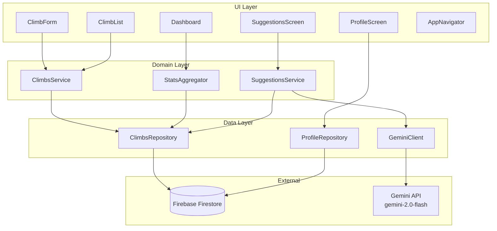

# Design Document: Climber App

## Overview

The Climber App is a React Web application (Vite + TypeScript) for rock climbers. It enables climbers to log routes, track progress, view statistics, and receive AI-powered route suggestions via the Gemini API. Data is persisted in Firebase Firestore. The UI is built with React 18, styled with Vanilla CSS, and charts use Recharts.

The architecture enforces a strict three-layer separation: UI → Domain → Data. No layer may skip another. Module boundaries are enforced at the import level.

---

## Architecture



---

## Tech Stack

| Category | Technology | Notes |
|----------|-----------|-------|
| Language | TypeScript 5.x | Strict mode |
| Frontend | React 18 + Vite | Web SPA |
| Styling | Vanilla CSS | No inline styles (SC-006) |
| Charts | Recharts | Grade trends, success rate |
| Backend / DB | Firebase Firestore | Cloud persistence |
| AI | `@google/generative-ai` | `gemini-2.0-flash` |
| i18n | react-i18next | zh-TW default, en fallback |
| State | React Context / Zustand | v1 |
| Testing | Vitest + RTL + fast-check | Unit + property tests |

---

## Project Structure

```
src/
├── climbs/
│   ├── ClimbForm.tsx
│   ├── ClimbList.tsx
│   ├── climbsService.ts
│   ├── climbsRepository.ts
│   └── types.ts
├── dashboard/
│   ├── Dashboard.tsx
│   └── statsAggregator.ts
├── suggestions/
│   ├── SuggestionsScreen.tsx
│   ├── suggestionsService.ts
│   └── geminiClient.ts
├── profile/
│   ├── ProfileScreen.tsx
│   └── profileRepository.ts
├── services/
│   ├── firebase.ts
│   └── firestoreCollections.ts
├── shared/
│   ├── utils/
│   │   └── gradeUtils.ts
│   ├── types/
│   │   └── errorTypes.ts
│   └── i18n/
│       ├── index.ts
│       ├── zh-TW.json
│       └── en.json
├── navigation/
│   └── AppNavigator.tsx
├── App.tsx
└── main.tsx
```

---

## Layer Rules

| Rule | Detail |
|------|--------|
| UI → Domain only | UI components call Services/Domain; never import Repository directly |
| `shared/` is isolated | `shared/` must not import from any feature module |
| Dashboard is read-only | `dashboard/` must not write or mutate Climb data |
| Suggestions are transient | `suggestions/` must not persist data to Firestore |
| Grade validation is centralized | All grade logic lives in `shared/utils/gradeUtils.ts` |
| Backend is abstracted | All Firestore calls go through `services/` |

---

## Data Model

### Climb (Firestore collection: `climbs`)

```typescript
interface Climb {
  id: string;              // UUID
  routeName: string;       // required
  grade: string;           // required, raw input
  gradeSystem: 'v-scale' | 'yds' | 'unknown';
  gradeWarning: boolean;
  date: string;            // ISO 8601 YYYY-MM-DD
  location?: string;
  result: 'sent' | 'attempt';
  notes?: string;
  createdAt: string;       // ISO 8601 timestamp
}
```

### UserProfile (Firestore document: `userProfile/singleton`)

```typescript
interface UserProfile {
  id: 'singleton';
  name?: string;
  homeGym?: string;
  climbingSince?: string;
  goals?: string;
}
```

### AISuggestion (transient — never persisted)

```typescript
interface AISuggestion {
  name: string;
  grade: string;
  style: 'bouldering' | 'sport' | 'trad';
  reason: string;  // zh-TW
}
```

---

## Gemini Prompt Contract

**Model**: `gemini-2.0-flash`  
**API key**: `import.meta.env.VITE_GEMINI_API_KEY`

**System instruction** (injected on every request):
```
你是一位專業攀岩教練助理。你的唯一職責是根據攀岩者的程度與風格偏好，推薦適合的攀岩路線。
請勿回答與攀岩路線建議無關的任何問題。
回應格式必須為 JSON 陣列，每筆包含：name、grade、style、reason（繁體中文）。
```

**User turn template**:
```
攀岩者資訊：
- 最高難度：{maxGrade}
- 偏好風格：{style}

請推薦 3 條適合的路線。
```

---

## Environment Variables

| Variable | Required | Description |
|----------|----------|-------------|
| `VITE_GEMINI_API_KEY` | Yes | Gemini API key from aistudio.google.com |

Set in `.env.local` (git-ignored via `.env.*` rule).
