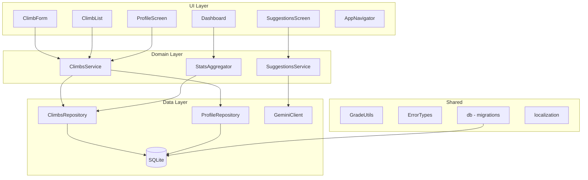

# Design Document: Climber App

## Overview

The Climber App is a mobile-first React Native application built with Expo. It enables climbers to log routes, track progress, view statistics, and receive AI-powered route suggestions via the Gemini API. All data is stored locally in SQLite with no authentication or cloud sync in v1.

The architecture enforces a strict three-layer separation: UI → Domain → Data. No layer may skip another. Module boundaries are enforced at the import level.

---

## Architecture



The UI layer never imports from the Data layer directly. All data flows through Domain services.

---

## Components and Interfaces

### ClimbsService (`src/climbs/climbsService.ts`)

```typescript
interface ClimbsService {
  addClimb(input: ClimbInput): Promise<Climb>;
  getClimbs(): Promise<Climb[]>;
}

interface ClimbInput {
  routeName: string;
  grade: string;
  date: string;        // ISO 8601
  result: 'sent' | 'attempt';
  location?: string;
  notes?: string;
}
```

Responsibilities:
- Validates required fields before persisting
- Delegates grade classification to `GradeUtils`
- Assigns UUID and `createdAt` timestamp
- Calls `ClimbsRepository` for persistence

### ClimbsRepository (`src/climbs/climbsRepository.ts`)

```typescript
interface ClimbsRepository {
  insert(climb: Climb): Promise<void>;
  findAll(): Promise<Climb[]>;
}
```

### StatsAggregator (`src/dashboard/statsAggregator.ts`)

```typescript
interface ClimbStats {
  totalClimbs: number;
  totalSends: number;
  totalAttempts: number;
  byGrade: Record<string, number>;
}

interface StatsAggregator {
  compute(climbs: Climb[]): ClimbStats;
}
```

Read-only. Never writes to the database.

### SuggestionsService (`src/suggestions/suggestionsService.ts`)

```typescript
type SuggestionError = 'api_error' | 'offline' | 'no_history';

interface SuggestionResult {
  suggestions: string[] | null;
  error: SuggestionError | null;
}

interface SuggestionsService {
  getSuggestions(input: SuggestionInput): Promise<SuggestionResult>;
}

interface SuggestionInput {
  maxGrade: string;
  style: string;
}
```

Responsibilities:
- Checks network state before calling Gemini
- Constructs prompt with system instruction
- Returns typed error states — never throws raw exceptions
- Never persists responses

### GeminiClient (`src/suggestions/geminiClient.ts`)

```typescript
interface GeminiClient {
  complete(systemInstruction: string, userPrompt: string): Promise<string>;
}
```

Isolated behind `SuggestionsService`. No other module imports this.

### ProfileRepository (`src/profile/profileRepository.ts`)

```typescript
interface ProfileRepository {
  get(): Promise<UserProfile | null>;
  save(profile: UserProfile): Promise<void>;
}
```

Always uses `id: 'singleton'`.

### GradeUtils (`src/shared/gradeUtils.ts`)

```typescript
interface GradeResult {
  gradeSystem: 'v-scale' | 'yds' | 'unknown';
  hasWarning: boolean;
}

function classifyGrade(grade: string): GradeResult;
```

The sole location for grade validation. V-scale regex: `/^[Vv](1[0-7]|[0-9])$/`. YDS regex: `/^5\.(1[0-5][a-d]?|[0-9])$/`.

### Localization (`src/shared/localization.ts`)

```typescript
type Locale = 'en' | 'zh-TW';

function t(key: string): string;
function getLocale(): Locale;
```

Reads device locale via `expo-localization`. Falls back to `'en'` for missing keys. Translation files stored as `src/shared/locales/en.json` and `src/shared/locales/zh-TW.json`.

---

## Data Models

```typescript
interface Climb {
  id: string;              // UUID v4
  routeName: string;
  grade: string;
  gradeSystem: 'v-scale' | 'yds' | 'unknown';
  date: string;            // ISO 8601
  location?: string;
  result: 'sent' | 'attempt';
  notes?: string;
  createdAt: string;       // ISO 8601
}

interface UserProfile {
  id: 'singleton';
  name?: string;
  homeGym?: string;
  climbingSince?: string;
  goals?: string;
}
```

### SQLite Schema

```sql
-- Migration v1
CREATE TABLE IF NOT EXISTS climbs (
  id TEXT PRIMARY KEY,
  routeName TEXT NOT NULL,
  grade TEXT NOT NULL,
  gradeSystem TEXT NOT NULL CHECK(gradeSystem IN ('v-scale', 'yds', 'unknown')),
  date TEXT NOT NULL,
  location TEXT,
  result TEXT NOT NULL CHECK(result IN ('sent', 'attempt')),
  notes TEXT,
  createdAt TEXT NOT NULL
);

CREATE TABLE IF NOT EXISTS user_profile (
  id TEXT PRIMARY KEY DEFAULT 'singleton',
  name TEXT,
  homeGym TEXT,
  climbingSince TEXT,
  goals TEXT
);

CREATE TABLE IF NOT EXISTS schema_migrations (
  version INTEGER PRIMARY KEY,
  appliedAt TEXT NOT NULL
);
```

### Database Migrations (`src/shared/db.ts`)

Migrations are an ordered array of `{ version: number, up: string }` objects. On app init, `db.ts` reads `schema_migrations`, compares against the registered list, and applies any pending migrations in ascending version order. If a migration throws, a typed `MigrationError` is surfaced and no further migrations run.

---

## Correctness Properties

*A property is a characteristic or behavior that should hold true across all valid executions of a system — essentially, a formal statement about what the system should do. Properties serve as the bridge between human-readable specifications and machine-verifiable correctness guarantees.*

### Property 1: Grade classification is total and exhaustive

*For any* grade string, `classifyGrade` SHALL return exactly one of `v-scale`, `yds`, or `unknown` — never throws, never returns null.

**Validates: Requirements 6.2, 6.4**

---

### Property 2: Unknown grades always carry a warning

*For any* grade string that is not a valid V-scale or YDS grade, `classifyGrade` SHALL return `hasWarning: true`.

**Validates: Requirements 6.3, 1.4**

---

### Property 3: Valid grades never carry a warning

*For any* grade string that is a valid V-scale or YDS grade, `classifyGrade` SHALL return `hasWarning: false`.

**Validates: Requirements 6.2**

---

### Property 4: Climb persistence round-trip

*For any* valid `ClimbInput`, calling `addClimb` then `getClimbs` SHALL return a list that contains a Climb whose `routeName`, `grade`, `gradeSystem`, `date`, and `result` match the input.

**Validates: Requirements 1.1, 2.1**

---

### Property 5: Stats are consistent with climb list

*For any* list of Climb records, `StatsAggregator.compute` SHALL return `totalClimbs === climbs.length`, `totalSends === climbs.filter(c => c.result === 'sent').length`, and `totalAttempts === climbs.filter(c => c.result === 'attempt').length`.

**Validates: Requirements 3.1, 3.2**

---

### Property 6: Grade breakdown covers all climbs

*For any* list of Climb records, the sum of all values in `byGrade` SHALL equal `totalClimbs`.

**Validates: Requirements 3.3**

---

### Property 7: Offline state prevents Gemini calls

*For any* `SuggestionInput`, when the network is offline, `getSuggestions` SHALL return `{ suggestions: null, error: 'offline' }` without invoking `GeminiClient`.

**Validates: Requirements 4.4, 7.2**

---

### Property 8: Suggestions are never persisted

*For any* `SuggestionInput` that results in a successful Gemini response, the SQLite database SHALL contain no record of the response content after the call completes.

**Validates: Requirements 4.9, 8.4**

---

### Property 9: Localization key lookup never returns null

*For any* translation key and any supported locale, `t(key)` SHALL return a non-empty string — either the locale translation or the English fallback.

**Validates: Requirements 9.5**

---

### Property 10: Migration idempotence

*For any* database state where migration version N has already been applied, running the migration runner again SHALL NOT re-apply version N and SHALL leave the database state unchanged.

**Validates: Requirements 10.2**

---

## Error Handling

All errors are expressed as typed values, never raw exceptions surfaced to the UI.

```typescript
// src/shared/errorTypes.ts
type SuggestionError = 'api_error' | 'offline' | 'no_history';

interface MigrationError {
  type: 'migration_error';
  version: number;
  cause: string;
}
```

| Scenario | Error type | UI behavior |
|---|---|---|
| Gemini API failure | `api_error` | Non-blocking banner on SuggestionsScreen |
| Device offline | `offline` | Non-blocking banner on SuggestionsScreen |
| No climb history | `no_history` | Non-blocking banner on SuggestionsScreen |
| Migration failure | `MigrationError` | App-level error boundary, halt further migrations |
| Missing form field | Inline validation | Field-level error message in ClimbForm |

---

## Testing Strategy

### Dual Testing Approach

Both unit tests and property-based tests are required. They are complementary:

- **Unit tests** verify specific examples, edge cases, and error conditions
- **Property tests** verify universal properties hold across all generated inputs

### Property-Based Testing Library

**`fast-check`** — TypeScript-native, works in Jest/Vitest, no additional runtime needed.

```bash
npm install --save-dev fast-check
```

Each property test runs a minimum of **100 iterations**.

Each property test is annotated with:
```
// Feature: climber-app, Property N: <property text>
```

### Test Coverage by Component

| Component | Unit tests | Property tests |
|---|---|---|
| `GradeUtils` | V-scale boundaries, YDS boundaries, freetext | Properties 1, 2, 3 |
| `ClimbsService` + `ClimbsRepository` | Required field validation, UUID assignment | Property 4 |
| `StatsAggregator` | Empty list, single climb, mixed results | Properties 5, 6 |
| `SuggestionsService` | Offline mock, API error mock, no history | Property 7 |
| `ProfileRepository` | Save then load, overwrite singleton | — |
| `db` migrations | Version ordering, halt on failure | Property 10 |
| `localization` | Known key en, known key zh-TW, missing key | Property 9 |

### Unit Test Focus Areas

- `ClimbForm` validation: empty fields, whitespace-only route name
- `SuggestionsScreen` error banner rendering for each error type
- `Dashboard` zero-state rendering
- `ClimbList` empty-state rendering
